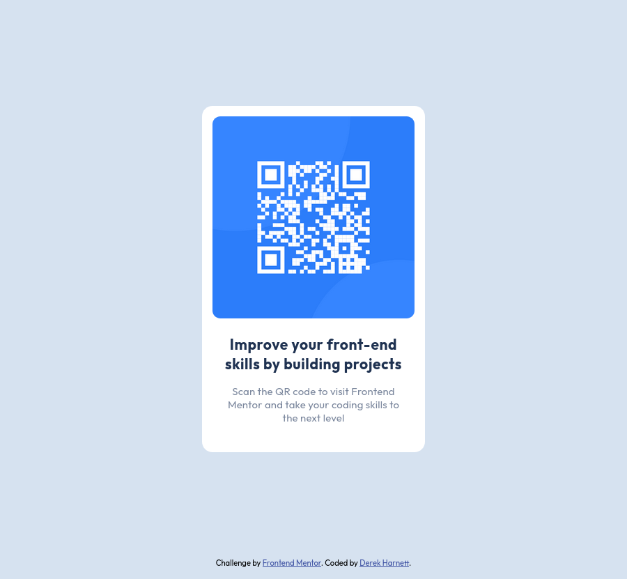

# Frontend Mentor - QR code component solution

This is a solution to the [QR code component challenge on Frontend Mentor](https://www.frontendmentor.io/challenges/qr-code-component-iux_sIO_H). Frontend Mentor challenges help you improve your coding skills by building realistic projects.

## Table of contents

- [Overview](#overview)
  - [Screenshot](#screenshot)
  - [Links](#links)
- [My process](#my-process)
  - [Built with](#built-with)
  - [What I learned](#what-i-learned)
  - [Continued development](#continued-development)
  - [Useful resources](#useful-resources)
- [Author](#author)
- [Acknowledgements](#acknowledgements)

## Overview

### Screenshot

### Links

- Solution URL: [https://github.com/harnettd/qr-code](https://github.com/harnettd/qr-code)
- Live Site URL: [https://harnettd.github.io/qr-code/](https://harnettd.github.io/qr-code/)

## My process

### Built with

- HTML5
- CSS
- BEM

### What I learned

In this challenge, I learned how to
- use Google Fonts on a webpage
- select HTML elements using CSS class selectors
- specify lengths in rem units
- organize stylesheets using the BEM methodology.

### Continued development

Particular topics where further development on my part is needed include
- deciding whether to use margins or padding to add space around content
  - **Version 2 update:** Based on ideas I picked up while studying Bootstrap 5, 
  I generally add `* { margin-top: 0; }` to my stylesheet 
  and use `margin-bottom` to adjust spacing between elements. 
  Also, for elements with fixed width and padding,
  I find `box-sizing: border-box;` to be most convenient.
- specifying image widths and/or heights in a responsive way
  - **Version 2 update:** While not needed for this particular project, the 
  `<picture>` tag allows you to specify different images across breakpoints.
- **Version 3 update:** the placement of CSS code such as `html {font-size: 15px;}` within BEM methodology. 

### Useful resources

- [Google Fonts](https://fonts.google.com/) - Google's collection of open source fonts.
- [W3Schools CSS tutorial](https://www.w3schools.com/css/default.asp) - W3Schools's comprehensive tutorial on CSS, the language used to style webpages.
- [ScreenRuler](https://gnomecoder.wordpress.com/screenruler/) - An onscreen ruler for Ubuntu. This helped me extract lengths in pixels from design images.
- [BEM 101](https://css-tricks.com/bem-101/) - This is a good place to start learning about BEM.

## Author

- Github - [Derek Harnett](https://github.com/harnettd)
- Frontend Mentor - [@harnettd](https://www.frontendmentor.io/profile/harnettd)

## Acknowledgements

- Thanks to [Frontend Mentor](https://www.frontendmentor.io/) for posting this challenge.
- Thanks to [@Ambe-Mbong-Nwi](https://www.frontendmentor.io/profile/Ambe-Mbong-Nwi) for helpful feedback on my submission.
